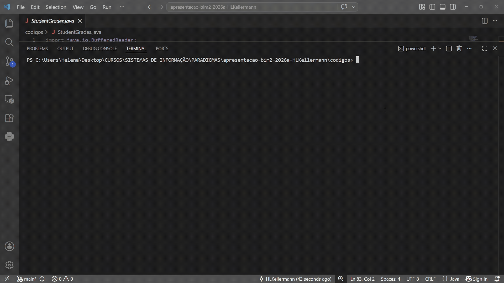
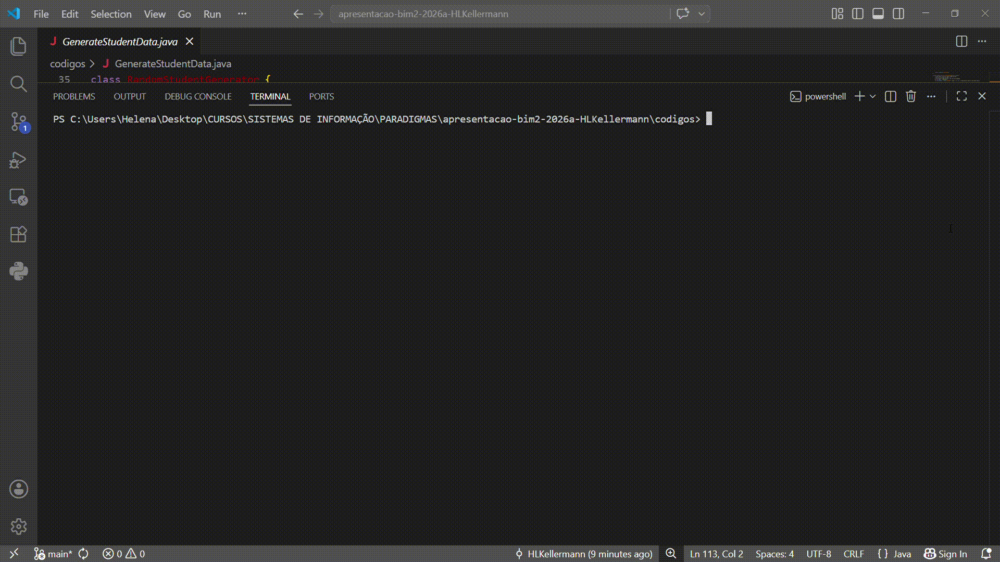
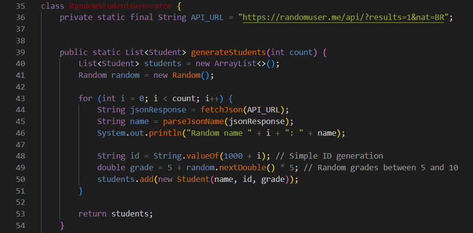
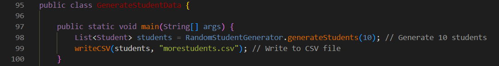
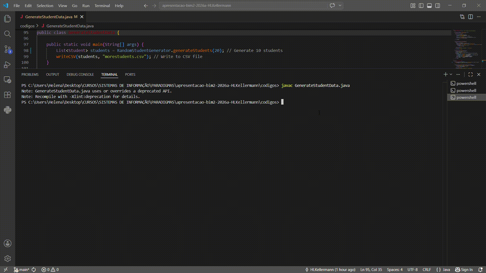
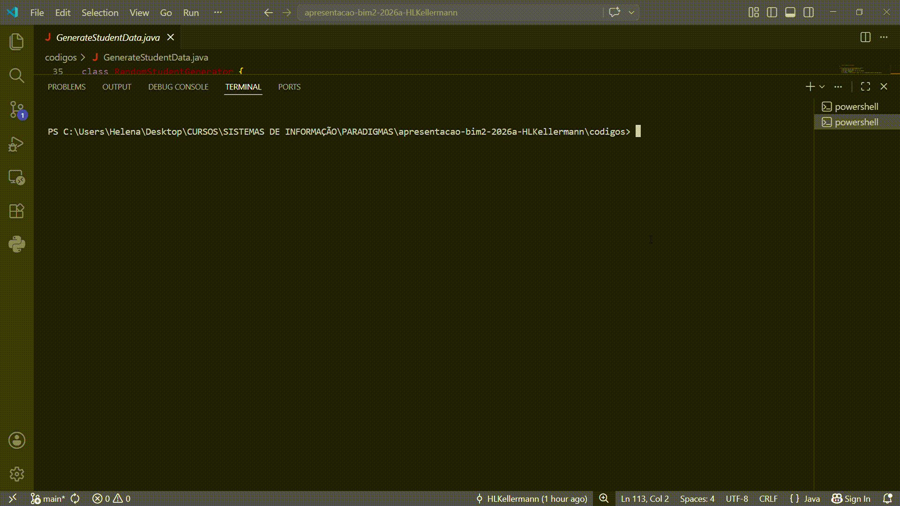
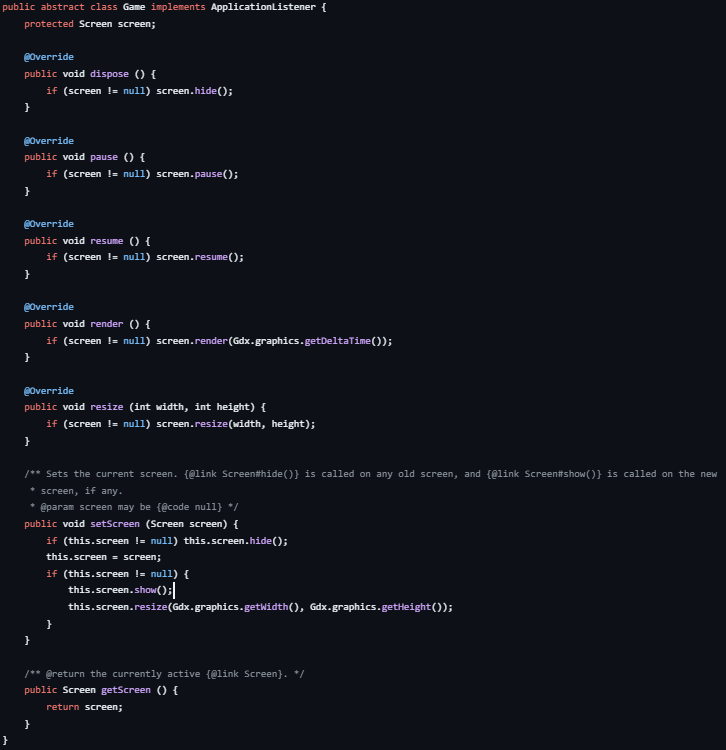
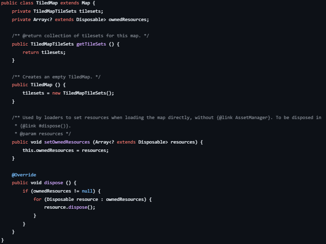

# apresentacao-bim2-2026a-HLKellermann

<h1>Parte Prática</h1>

<h3>Escolha do Ambiente:</h3>
Escolhi usar o VSCode por questão de praticidade mesmo, instalei a extensão para java, clonei o repositório da apresentação e adicionei/criei os arquivos/pastas necessários. Baixei também o JDK 26 da Oracle.  

<h3>Execução do 1º código: StudentGrades.java</h3>

O que ele faz: lê o arquivo.csv e calcula a média aritmética das notas

<h3>Execução do 2º código: GenerateStudentData.java </h3>

O que ele faz: gera estudantes aleatórios e salva os dados de cada um (nome, ID, nota) no arquivo 'morestudents.csv'

<h3>Processo de Execução:</h3>
Havia adicionado os arquivos .java, mas esqueci de adicionar também o arquivo 'students.csv', o que resultou na seguinte mensagem ao tentar executar o 'StudentGrades.java':

<h4>Error reading file: students.csv (O sistema não pode encontrar o arquivo especificado)<br>Arithmetic Mean of Grades: 0.0</h4>

Foi fácil de resolver, adicionei no repositório o .csv que a professora havia fornecido junto aos .java da atividade de compreensão de código.


<h1>Parte Teórica</h1>

<h3>Pergunta 04:</h3>
<h4>O que significa Random random = new Random()?</h4>

'new Random()' cria um novo objeto da classe 'Random' ao iniciar o gerador de número aleatório, e a variável random referencia esse objeto. Aqui nesse código, random é usado para gerar a nota do aluno ao chamar nextDouble()(pergunta 05).




<h3>Pergunta 09:</h3>
<h4>Onde é especificada a quantidade de estudantes a serem gerados?</h4>

Como podemos ver na imagem abaixo, a quantidade de estudantes é especificada na chamada do método 'generateStudents': ela é passada como parâmetro (int count) do método 'generateStudents' da classe RandomStudentGenerator.



<h4>Se alterarmos a quantidade de estudantes a serem gerados:</h4>


Percebi que ao alterar o parâmetro, alguns estudantes ficam com as informações 's' e 'ts'

<h3>Pergunta 13:</h3>
<h4>Como este programa se comporta sem acesso à internet?</h4>



```java
class RandomStudentGenerator {
    //tenta acessar randomuser.me
    private static final String API_URL = "https://randomuser.me/api/?results=1&nat=BR";


    public static List<Student> generateStudents(int count) {
        List<Student> students = new ArrayList<>();
        Random random = new Random();

        for (int i = 0; i < count; i++) {
            //fetchJson cai na excecao e retorna uma string vazia
            String jsonResponse = fetchJson(API_URL);
            //tenta pegar o nome, mas json.substring tenta acessar posicoes inexistente, gerando a excecao StringIndexOutOfBoundException, o rastreamento de erro mostra onde aconteceu
            String name = parseJsonName(jsonResponse);
            System.out.println("Random name " + i + ": " + name);

            String id = String.valueOf(1000 + i); // Simple ID generation
            double grade = 5 + random.nextDouble() * 5; // Random grades between 5 and 10
            students.add(new Student(name, id, grade));
        }

        return students;
    }


    private static String fetchJson(String apiUrl) {
        StringBuilder response = new StringBuilder();
        try {
            URL url = new URL(apiUrl);
            HttpURLConnection connection = (HttpURLConnection) url.openConnection();
            connection.setRequestMethod("GET");
            try (BufferedReader reader = new BufferedReader(new InputStreamReader(connection.getInputStream()))) {
                String line;
                while ((line = reader.readLine()) != null) {
                    response.append(line);
                }
            }
        } catch (IOException e) {
            System.out.println("Error fetching data: " + e.getMessage());
        }
        return response.toString();
    }

    private static String parseJsonName(String json) {
        // Very basic and not robust JSON parsing
        // Do not try this at home :-)
        // For better JSON parsing, see org.json package
        String name = "Unknown";
        int startIndex = json.indexOf("\"name\":") + 8; // Adjusted to skip to the name object
        if (startIndex != -1) {
            int firstNameIndex = json.indexOf("\"first\"", startIndex) + 9; // Skip to first name
            int firstNameEnd = json.indexOf("\"", firstNameIndex);
            int lastNameIndex = json.indexOf("\"last\"", firstNameEnd) + 8; // Skip to last name
            int lastNameEnd = json.indexOf("\"", lastNameIndex);
            String firstName = json.substring(firstNameIndex, firstNameEnd);
            String lastName = json.substring(lastNameIndex, lastNameEnd);
            name = firstName + " " + lastName;
        }
        return name;
    }
}
```

<h1>Parte Exploratória</h1>

<h3>Projeto Open Source: [libgdx](https://github.com/libgdx/libgdx)</h3>
O libgdx é um framework para desenvolvimento de jogos em Java, compatível com Windows, Linux, Android, iOS e HTML5.<br>
Escolhi esse pois já conhecia e achei interessante traze-lo, pois futuramente iremos utilizá-lo (possivelmente)

<h3>Classes:</h3>

[Game Class](https://github.com/libgdx/libgdx/blob/master/gdx/src/com/badlogic/gdx/Game.java)

A classe Game representa a estrutura principal do jogo e controla as telas dele.



[TiledMap Class](https://github.com/libgdx/libgdx/blob/master/gdx/src/com/badlogic/gdx/maps/tiled/TiledMap.java)
Por o que vi, a classe TiledMap representa um mapa/cenário do jogo, ela carrega os mapas criados no programa Tiled.<br>
Aqui temos um exemplo de herança: TiledMap herda da classe Map<br>
*Consegui entender a função geral da classe, mas não peguei bem toda ela, por exemplo o 'setOwnedResources'.



<h1>Fontes:</h1>

[POO 01](https://liascript.github.io/course/?https://raw.githubusercontent.com/AndreaInfUFSM/elc117-2026a/main/classes/19/README.md#1)
[Java.Util.Random]https://learn.microsoft.com/en-us/dotnet/api/java.util.random?view=net-android-35.0
[10 Open Source Java Projects](https://medium.com/@lreverchuk/top-10-java-open-source-projects-on-github-f75755d1a14a)